# Ticketora

Ticketora, etkinlikleri listelemek, filtrelemek ve kullanıcıların dijital bilet oluşturmasını sağlamak için geliştirilmiş bir ASP.NET Core MVC uygulamasıdır. Projede kullanıcı kayıt/giriş işlemleri, rol bazlı admin paneli, etkinlik ve kategori yönetimi, katılımcı takibi ve bilet satın alma akışı yer alır.

## Özellikler

- Etkinlik listeleme, detay görüntüleme ve filtreleme
- Kategori, şehir/lokasyon ve tarih bazlı etkinlik arama
- Kullanıcı kayıt, giriş ve çıkış işlemleri
- ASP.NET Core Identity ile kimlik doğrulama
- Admin rolü için etkinlik, kategori ve katılımcı yönetimi
- Dijital bilet oluşturma ve kullanıcıya ait bilet detaylarını görüntüleme
- Benzersiz bilet numarası üretimi
- Aktif/yaklaşan etkinlik istatistikleri

## Kullanılan Teknolojiler

- **.NET 9**
- **ASP.NET Core MVC**
- **Entity Framework Core**
- **SQL Server**
- **ASP.NET Core Identity**
- **MediatR**
- **CQRS Design Pattern**
- **N-Tier Architecture**
- **Bootstrap**
- **jQuery**
- **Razor Views**

## Proje Yapısı

```text
Ticketora
|-- Core
|   |-- Ticketora.Domain
|   `-- Ticketora.Application
|-- Infrastructure
|   |-- Ticketora.Infrastructure
|   `-- Ticketora.Persistence
|-- Presentation
|   `-- Ticketora.WebUI
`-- Ticketora.sln
```

- **Domain:** Event, Category, Participant ve Ticket gibi temel entity sınıflarını içerir.
- **Application:** CQRS ve MediatR tabanlı command, query ve handler katmanlarını içerir.
- **Persistence:** Entity Framework Core DbContext, Identity kullanıcı modeli ve migration dosyalarını içerir.
- **WebUI:** MVC controller, Razor view, view model ve statik dosyaları içerir.

## Ekran Görüntüleri

### Ana Sayfa

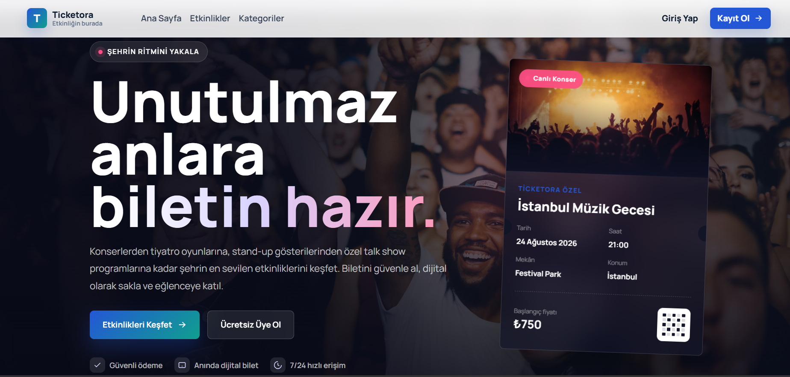

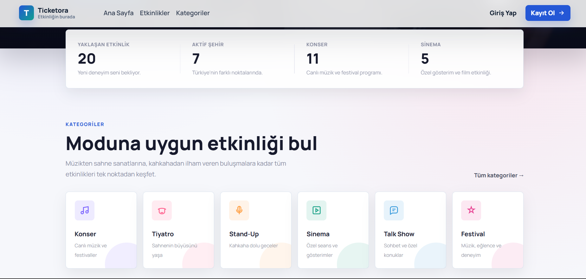

### Etkinlikler

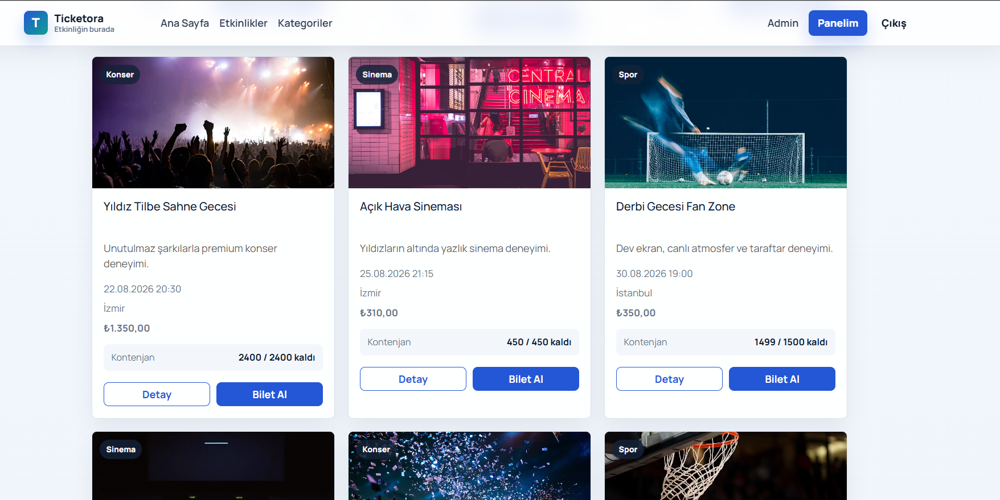

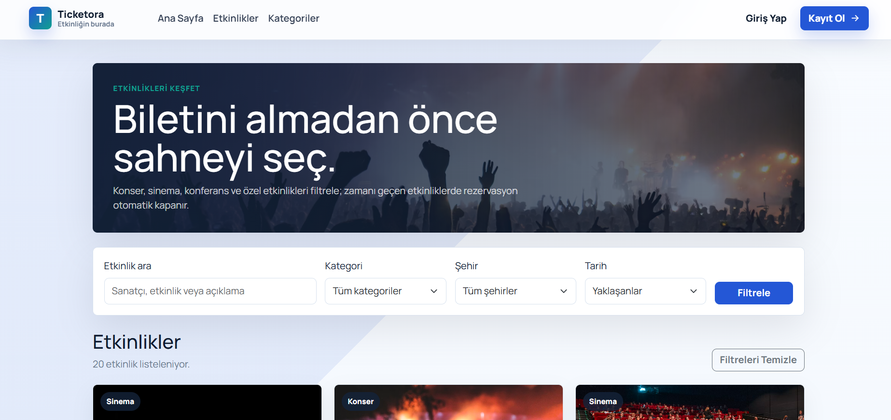

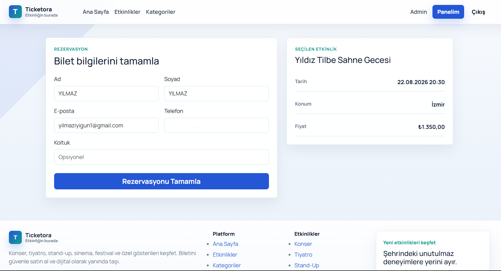

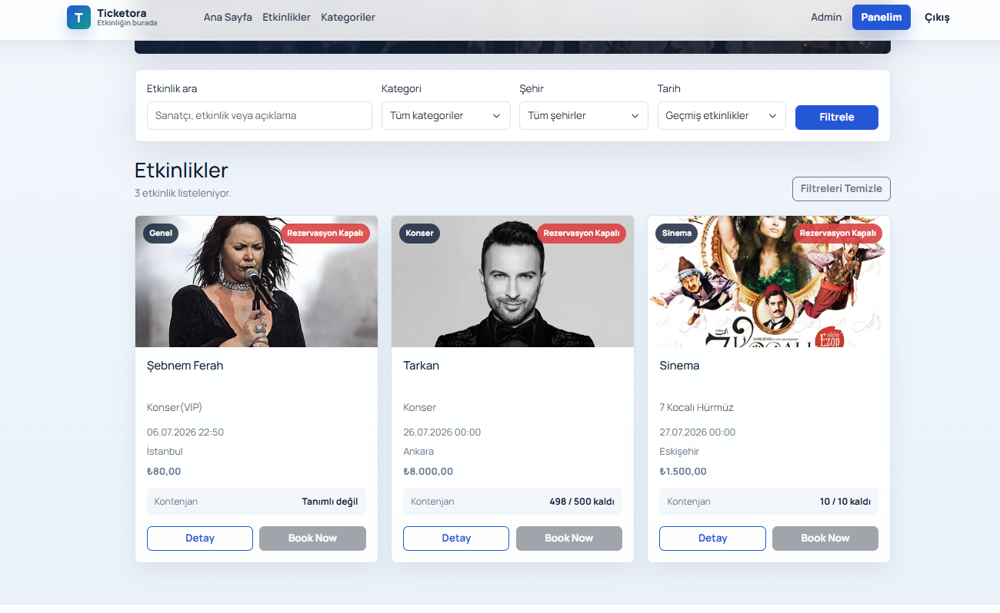

### Bilet Akışı

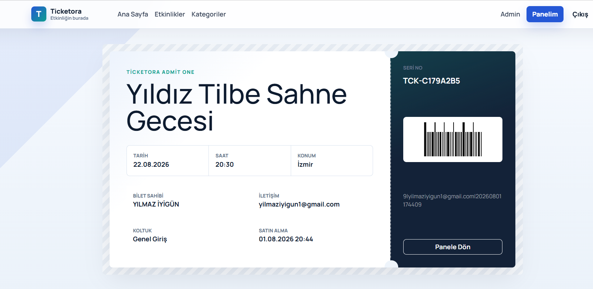

### Kullanıcı İşlemleri

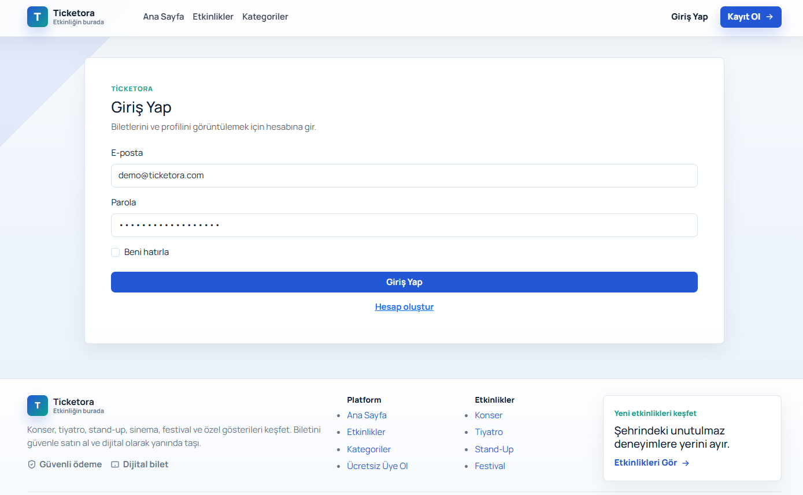

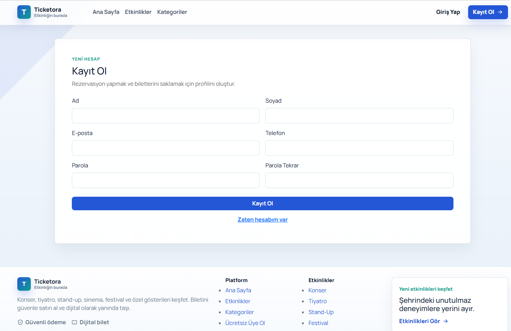

### Admin Paneli

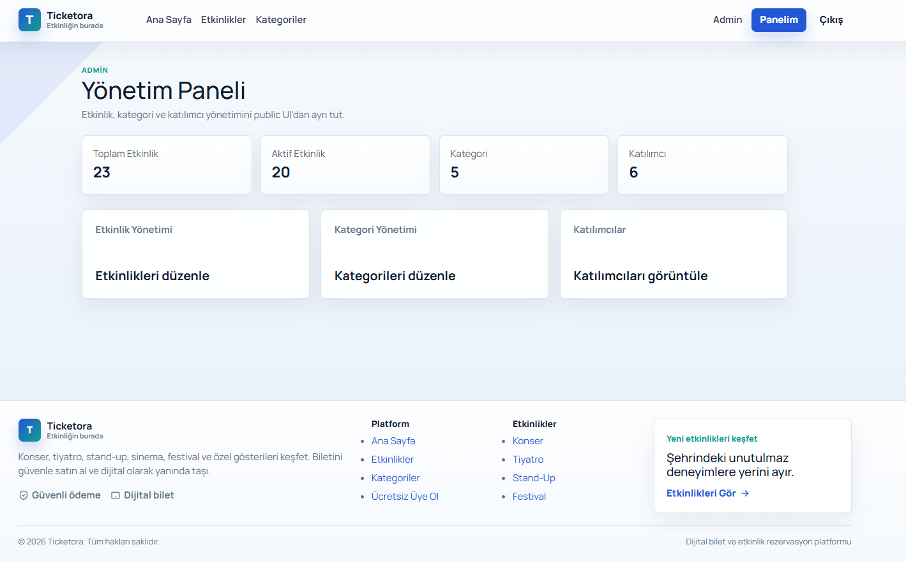

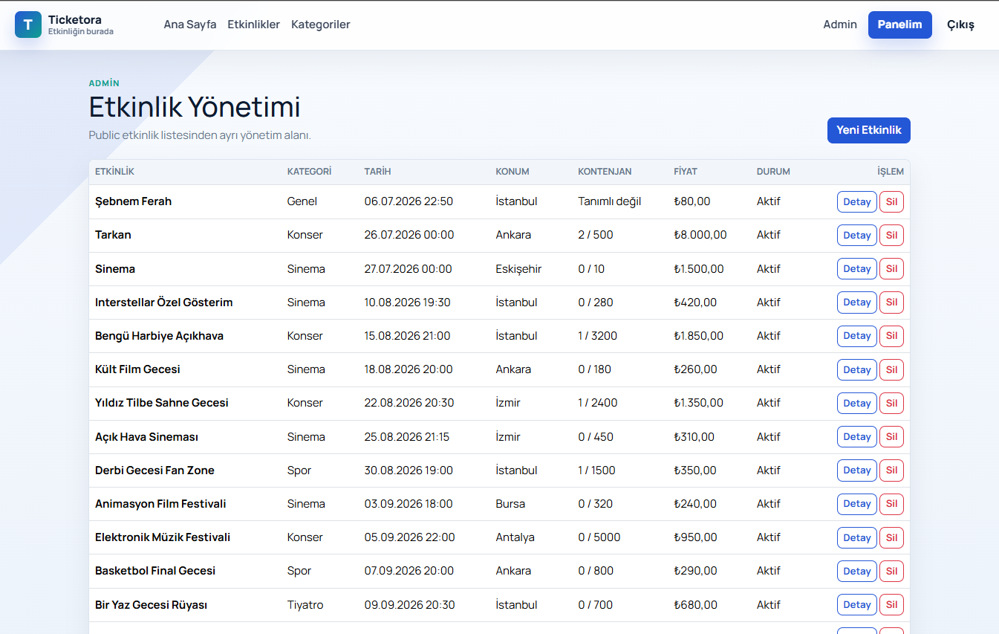

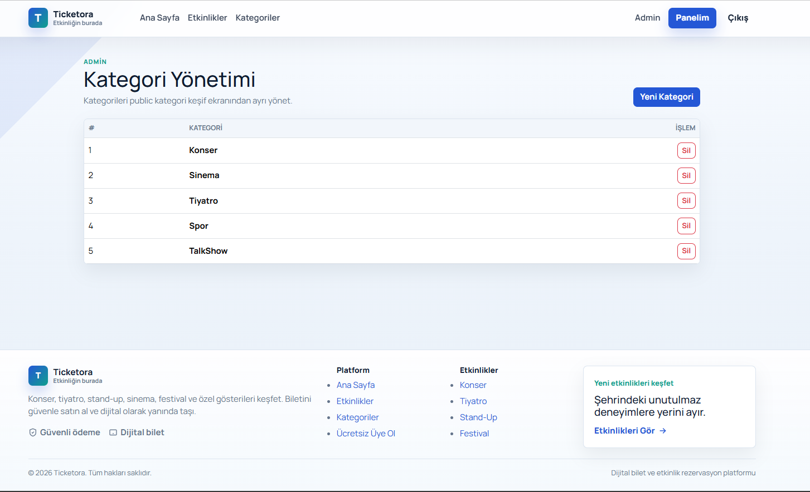

### Footer

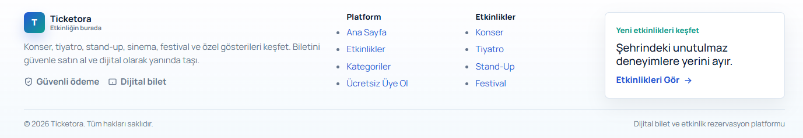

## Kurulum

Projeyi klonlayın:

```bash
git clone https://github.com/yilmaziyigun/Ticketora.git
cd Ticketora
```

Bağımlılıkları yükleyin:

```bash
dotnet restore
```

Veritabanı bağlantısını kendi SQL Server ortamınıza göre düzenleyin:

```csharp
optionsBuilder.UseSqlServer("Server=YOUR_SERVER;Database=TicketOraDb;Trusted_Connection=True;TrustServerCertificate=True");
```

Migration dosyalarını veritabanına uygulayın:

```bash
dotnet ef database update --project Infrastructure/Ticketora.Persistence --startup-project Presentation/Ticketora.WebUI
```

Uygulamayı çalıştırın:

```bash
dotnet run --project Presentation/Ticketora.WebUI
```

## Notlar

- Admin paneline erişmek için admin rolüne sahip bir kullanıcı gerekir.
- Varsayılan bağlantı bilgisi yerel geliştirme ortamına göre düzenlenmelidir.
- Görseller `docs/images` klasöründe tutulur ve README içinde göreli yollarla kullanılır.
